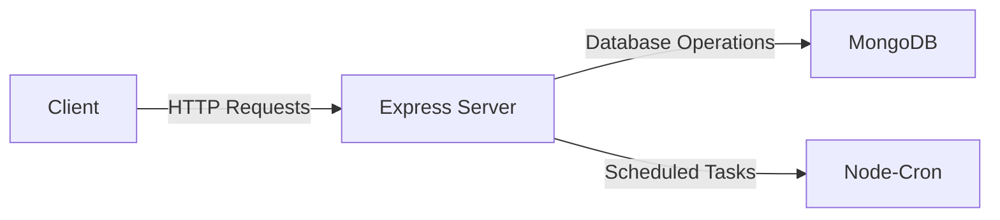

# Cloud Backend

A robust backend service for cloud applications, leveraging MongoDB for data storage and Express for API management.

## Features
- **MongoDB Integration**: Seamlessly connect and interact with MongoDB for data persistence.
- **RESTful API**: Build and manage APIs using Express.js.
- **Cron Jobs**: Schedule tasks with node-cron for automated processes.
- **Logging**: Utilize morgan for HTTP request logging to monitor activity.
- **CORS Support**: Enable Cross-Origin Resource Sharing for frontend-backend communication.
- **Environment Configuration**: Use dotenv for managing environment variables securely.

## Architecture

## Tech Stack
- **Node.js**: JavaScript runtime for building scalable network applications.
- **Express.js**: Web framework for Node.js to build APIs.
- **MongoDB**: NoSQL database for flexible data storage.
- **Axios**: Promise-based HTTP client for making requests.
- **Node-Cron**: Task scheduler for executing jobs at scheduled times.
- **dotenv**: Module to load environment variables from a `.env` file.

## Usage

Once the server is running, you can interact with the API endpoints to perform CRUD operations on your data. Ensure your MongoDB instance is running and accessible.

## API Endpoints

- **GET /api/checks**: Retrieve all checks.
- **POST /api/checks**: Create a new check.
- **GET /api/checks/:id**: Retrieve a specific check by ID.
- **PUT /api/checks/:id**: Update a specific check by ID.
- **DELETE /api/checks/:id**: Delete a specific check by ID.

## Roadmap
- [ ] Implement user authentication and authorization.
- [ ] Add more detailed logging and monitoring features.
- [ ] Expand API endpoints for additional functionalities.
- [ ] Improve error handling and validation.
